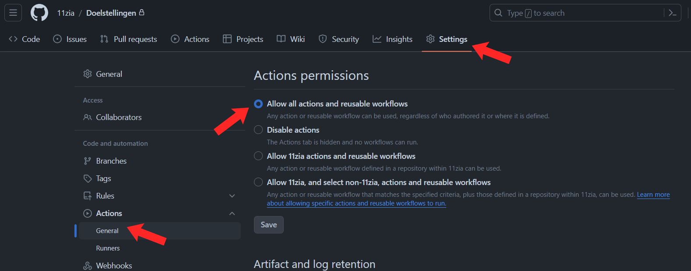
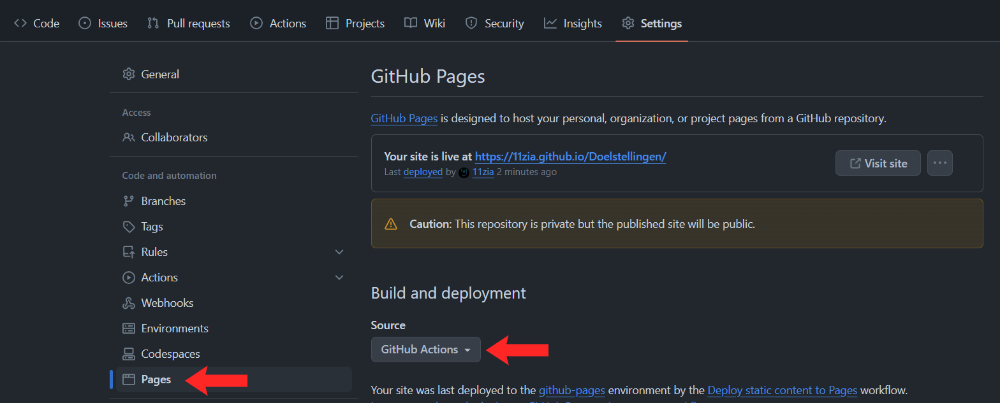

> Table of Contents

- [Installation](#installation) - [Step 1 - Copy Repository](#step-1---copy-repository) - [Step 2 - Copy Repository](#step-2---copy-repository) - [Step 3 - Enable Actions \& Pages](#step-3---enable-actions--pages) - [Step 4 - Create base folder \& clone repo](#step-4---create-base-folder--clone-repo) - [Step 5 - Change name](#step-5---change-name) - [Step 6 - Upload updates to GitHub](#step-6---upload-updates-to-github) - [Step 7 - Set the GitHub pages link in the about section](#step-7---set-the-github-pages-link-in-the-about-section)
- [Updates](#updates) - [Modify Learning Goals](#modify-learning-goals) - [Verify Learning Goal (Coaches)](#verify-learning-goal-coaches)

---

# Installation

#### Step 1 - Copy Repository

- Copy the code URL of the [base repository](https://github.com/Thomas-More-Digital-Innovation/2324-DI-Doelstellingen).
  - [https://github.com/Thomas-More-Digital-Innovation/2324-DI-Doelstellingen.git]()
- Click on the `+` at the top right &rarr; `Import Repository`
  - Or click [here](https://github.com/new/import) to go to the link.
- `

#### Step 2 - Copy Repository

- 1 - Enter the link you just copied.
- 2 - Enter a repository name. (e.g. `LearningGoals`)
- 3 - Make the repository `Private`. (Optional)
- 4 - Click on `Begin import`.
- 

#### Step 3 - Enable Actions & Pages

- Go to the `Settings` of your repository.
- Go to `Actions` &rarr; `General` in the left menu.
- Under `Actions Permissions` choose `Allow all actions and reusable workflows`
- Click on `Save`.
  
- Go to `Pages` in the left menu.
- Under `Build and Deployment` change the source from `Deploy from a branch` to `Github Actions`.
- 

#### Step 4 - Create base folder & clone repo

- Create a folder on your computer with the same name as your GitHub repository
- Go to this folder in your CMD and clone the repository you just created.
  ```bash
  git clone <REPO_LINK> .
  ```

#### Step 5 - Change name

- In the [index.html](index.html) replace `[Name Here]` everywhere with your own name.

#### Step 6 - Upload updates to GitHub

- Open the folder in CMD.
- Push the updates to GitHub with these commands.
  ```bash
  git add .
  git commit -m "<MESSAGE>"
  git push
  ```
- **The website will automatically go online using GitHub Actions within 1 to 5 minutes.**
  - It will be available at [https://<GITHUB_USERNAME>.github.io/<REPO_NAME>/]().

#### Step 7 - Set the GitHub pages link in the about section

- Go to the home page of your repository.
- Click on the gear icon to edit the about section
  
- 1 - Check: `Use your GitHub Pages website`.
- 2 - Click on `Save changes`.
  

---

# Updates

#### Modify Learning Goals

1. Go to [learninggoals.js](learninggoals.js) and find the learning goal you want to modify.
2. Change the following information:

   ```json
   "status": "", -- See different statuses below
   "verified": "", -- ONLY FOR COACHES
   "project": "", -- Project or course
   "evidence": "" -- Text with evidence of the achieved learning goal, more info below
   ```

   - status:
     - td &rarr; To Do
     - ip &rarr; In Progress
     - d &rarr; Done
   - evidence:
     - You can also add links using `<a href='<FILE_OR_LINK>' target='_blank'><Text></a>`
       - `<Text>` &rarr; The content you want to display.
       - `<FILE_OR_LINK>` &rarr; Link or file behind it.
     - If you want to add a PDF or another file, it's best to create an extra folder in the [assets](assets) folder with the learning goal number as its name. This keeps everything organized.
       
       - If you want an accordion for more overview in the evidence, you can use this function: `makeAccordion()`. More info in the example.
         
   - **Link example:** `<a href='assets/1.4/evidence.pdf' target='_blank'>1.4</a>`
     - This is a link to `evidence.pdf` under `assets`.
   - **Accordion example:**

     - Create a new `const` variable in the [accordion.js](accordion.js) file like below.
        <details><summary>Open const</summary>

       ```js
       const projectInfo = {
         title: "TITLE",
         text: `
           <div class='flex flex-col py-2'>
             <h2 class='text-lg font-bold'>Client</h2>
             <p>NAME</p>
           </div>
           <div class='flex flex-col py-2'>
             <h2 class='text-lg font-bold'>Project Description</h2>
             <p>DESCRIPTION</p>
           </div>
           <div class='flex flex-col py-2'>
             <h2 class='text-lg font-bold'>Project Duration</h2>
             <p>September 2023 &rarr; May 2024</p>
           </div>
           <div class='flex flex-col py-2'>
             <h2 class='text-lg font-bold'>Links</h2>
             <p>Github Repository: REPO LINK</p>
           </div>
         `,
       };
       ```

        </details>

     - Now you can use this in evidence.
     - e.g.:
       ```js
       evidence: `${makeAccordion(projectInfo)} Other text afterwards..`;
       ```
     - You can still add links or photos via HTML code.

3. Push the updates to GitHub.
   ```bash
   git add .
   git commit -m "<MESSAGE>"
   git push
   ```
4. After 1 - 3 minutes, the pages will be automatically updated.

#### Verify Learning Goal (Coaches)

- Open the learninggoals file on GitHub.
  
- Click on .
  
- Find the learning goal (CTRL+F also works).
- Enter your name at `"verified": "",`.
- Click on `Commit Changes...`.
  
- 1 - Enter a commit message.
- 2 - Enter a description. (Optional)
- 3 - Click on `Commit changes`.
  
- The GitHub pages will be automatically updated within 1 - 5 minutes.
