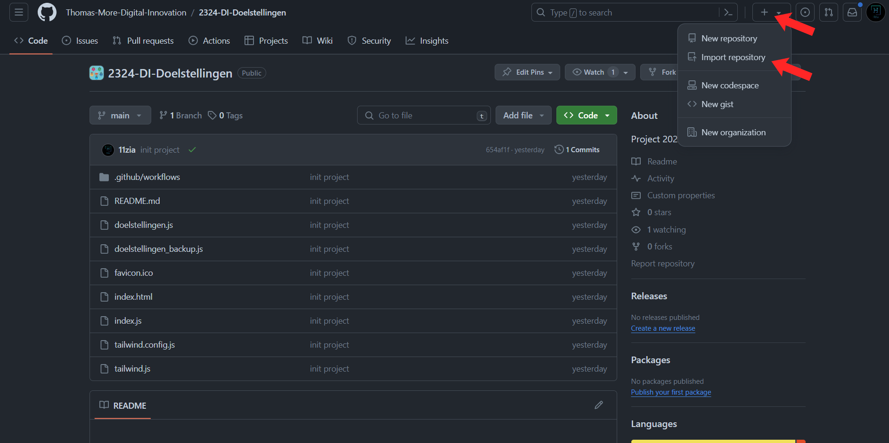
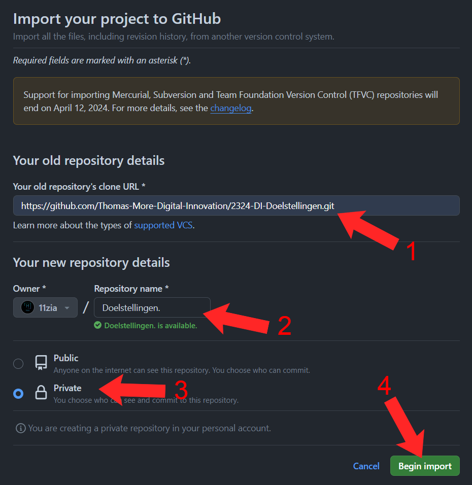
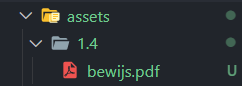
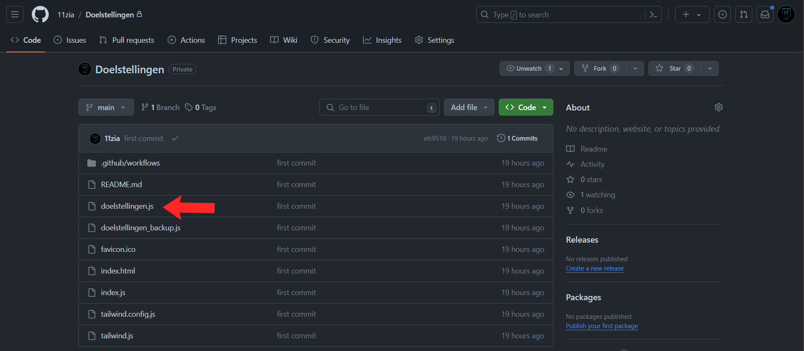
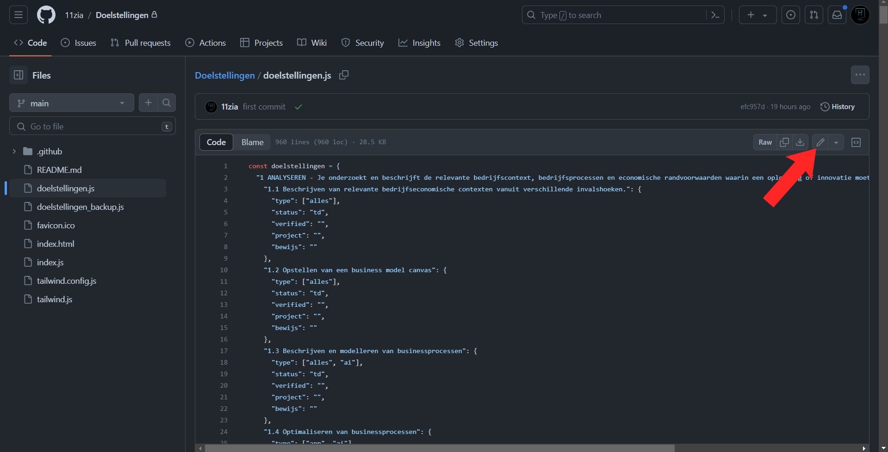
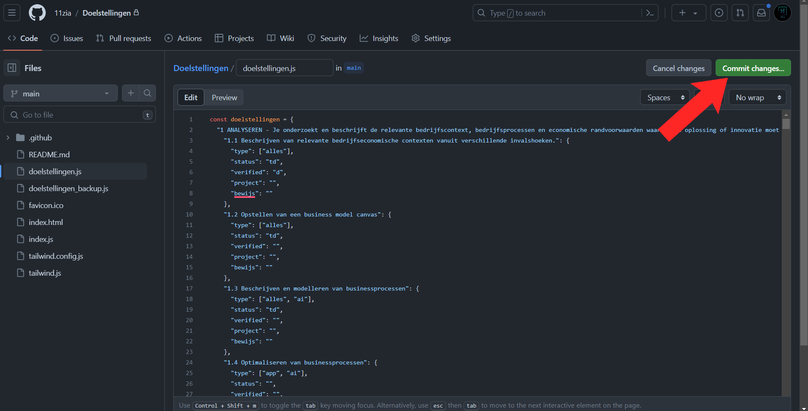
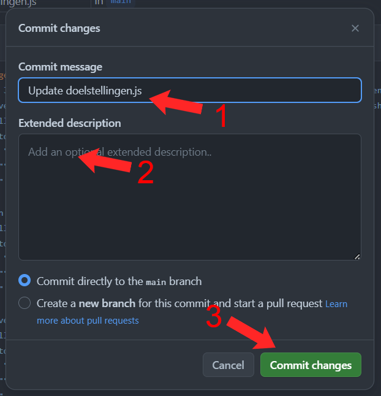

> Inhouds Tafel

- [Installatie](#installatie)
  \- [Stap 1 - Copy Repository](#stap-1---copy-repository)
  \- [Stap 2 - Copy Repository](#stap-2---copy-repository)
  \- [Stap 3 - Create base folder \& clone repo](#stap-3---create-base-folder--clone-repo)
  \- [Stap 5 - Verander naam](#stap-5---verander-naam)
  \- [Stap 6 - Upload de updates naar github](#stap-6---upload-de-updates-naar-github)
- [Updates](#updates)
  \- [Doelstellingen aanpassen](#doelstellingen-aanpassen)
  \- [Doelstelling verifiëren (Coaches)](#doelstelling-verifiëren-coaches)

---

# Installatie

#### Stap 1 - Copy Repository

- Copy de code url van de [basis repository](https://github.com/Thomas-More-Digital-Innovation/2324-DI-Doelstellingen).
  - [https://github.com/Thomas-More-Digital-Innovation/2324-DI-Doelstellingen.git]()
- Klik op de `+` rechts boven &rarr; `Import Repository`
  - Of klik [hier](https://github.com/new/import) om naar de link te gaan.
- `

#### Stap 2 - Copy Repository

- 1 - Vul de link die je net gecopieerd hebt in.
- 2 - Vul een repository naam in. (bv. `Doelstellingen`)
- 3 - Maak de repository `Private`. (Optional)
- 4 - Klik op `Begin import`.
- 

#### Stap 3 - Create base folder & clone repo

- Maak een folder op je computer met dezelfde naam als je GitHub repository
- Ga naar deze folder in je CMD en clone de repository die je net hebt gemaakt.
  ```bash
  git clone <REPO_LINK> .
  ```

#### Stap 5 - Verander naam

- In de [index.html](index.html) vervang je `NAAM` overal met je eigen naam.

#### Stap 6 - Upload de updates naar github

- Open de folder in CMD.
- Voer de updates door naar GitHub met deze commandos.
  ```bash
  git add .
  git commit -m "<MESSAGE>"
  git push
  ```
- **De website komt automatisch online m.b.v GitHub Actions tussen de 1 en 3 minuten.**

---

# Updates

#### Doelstellingen aanpassen

1. Ga naar de [doelstellingen.js](doelstellingen.js) en zoek de doelstelling die je wilt aanpassen.
2. Verander de volgende gegevens:
   ```json
   "status": "", -- Zie verschillende statussen hieronder
   "verified": "", -- ALLEEN VOOR COACHES
   "project": "", -- Project of vak
   "bewijs": "" -- Tekst met bewijs van de behaalde doelstelling, meer info hieronder
   ```
   - status:
     - td &rarr; To Do
     - ip &rarr; In Progress
     - d &rarr; Done
   - bewijs:
     - Je kan ook links bijvoegen m.b.v een `<a href="<BESTAND_OF_LINK>" target="_blank"><Tekst></a>`
       - `<Tekst>` &rarr; De inhoud dat je wilt laten zien.
       - `<BESTAND_OF_LINK>` &rarr; Link of bestand dat er achter zit.
     - Als je een PDF of een ander bestand wilt toevoegen is het best om in de [assets](assets) folder een extra folder te maken met als naam de doelstelling nummer. Zo houden we het overzichtelijk om alles bij te houden.
       
   - **Link voorbeeld:** `<a href="assets/1.4" target="_blank">1.4</a>`
     - Dit is een link naar de `1.4` folder onder de `assets`.
3. Voer de updates door naar GitHub.
   ```bash
   git add .
   git commit -m "<MESSAGE>"
   git push
   ```
4. Na 1 - 3 minuten wordt de pages automatisch aangepast.

#### Doelstelling verifiëren (Coaches)

- Open de doelstellingen file op GitHub.
  
- Klik op .
  
- Zoek de doelstelling (CTRL+F5 werkt ook).
- Voer je naam in bij `"verified": "",`.
- Klik op `Commit Changes...`.
  
- 1 - Voer een commit message in.
- 2 - Voer een beschrijving in. (Optional)
- 3 - Klik op `Commit changes`.
  
- De GitHub pages wordt automatisch aangepast binnen de 1 - 5 minuten.
